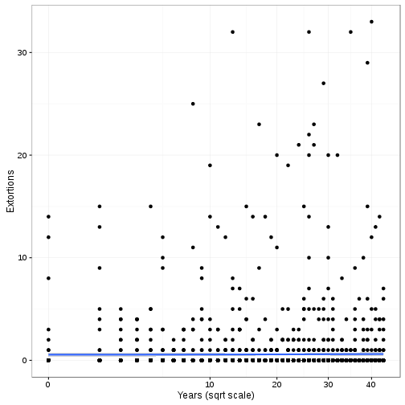
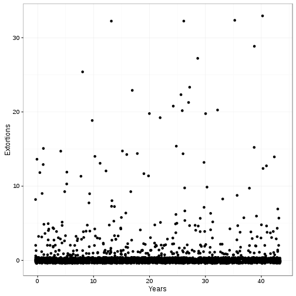
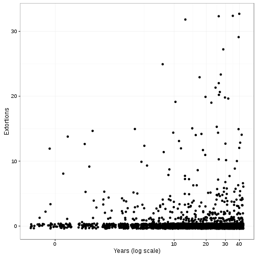
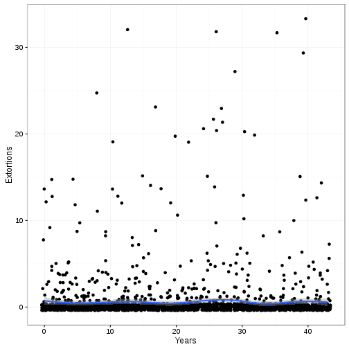
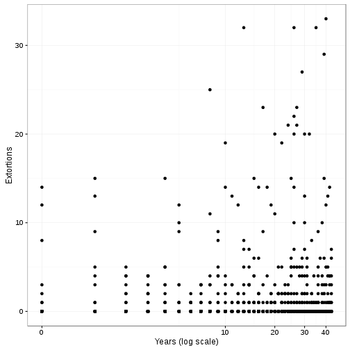
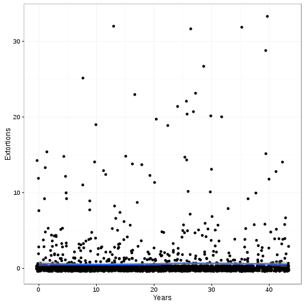
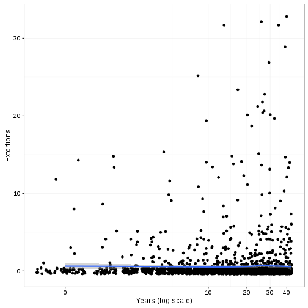
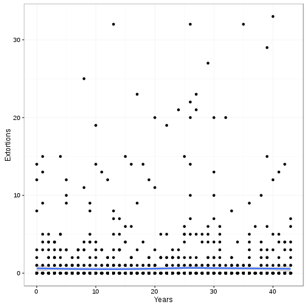
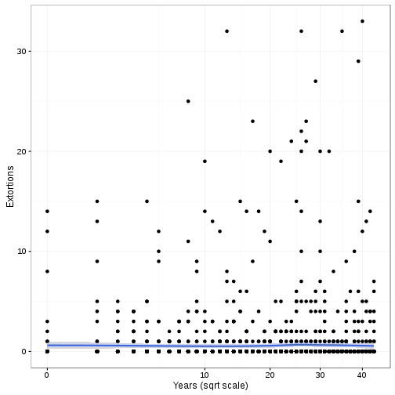
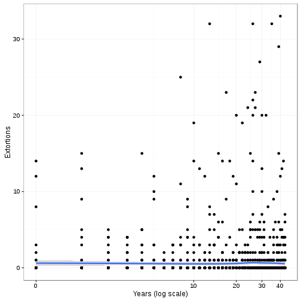

# Introduction

Script to analyze patterns of extortion victimization against Mexican businesses.

# Set up, data input and pre-process

## Session info

We first check details of the session and system, and for reproducibility, we set the random seed.


```r
starttime <- proc.time()
date()
```

```
[1] "Wed Dec  7 15:30:31 2016"
```

```r
sessionInfo()
```

```
R version 3.3.0 (2016-05-03)
Platform: x86_64-pc-linux-gnu (64-bit)
Running under: Red Hat Enterprise Linux Server 7.2 (Maipo)

locale:
 [1] LC_CTYPE=en_US.UTF-8       LC_NUMERIC=C              
 [3] LC_TIME=en_US.UTF-8        LC_COLLATE=en_US.UTF-8    
 [5] LC_MONETARY=en_US.UTF-8    LC_MESSAGES=en_US.UTF-8   
 [7] LC_PAPER=en_US.UTF-8       LC_NAME=C                 
 [9] LC_ADDRESS=C               LC_TELEPHONE=C            
[11] LC_MEASUREMENT=en_US.UTF-8 LC_IDENTIFICATION=C       

attached base packages:
[1] stats     graphics  grDevices utils     datasets  methods   base     

other attached packages:
 [1] rmarkdown_1.1    classInt_0.1-23  glmmADMB_0.8.3.3 MASS_7.3-45     
 [5] lme4_1.1-12      Matrix_1.2-6     texreg_1.36.7    Cairo_1.5-9     
 [9] ggplot2_2.1.0    foreign_0.8-67   knitr_1.14      

loaded via a namespace (and not attached):
 [1] Rcpp_0.12.7      magrittr_1.5     splines_3.3.0    munsell_0.4.3   
 [5] colorspace_1.2-6 lattice_0.20-33  minqa_1.2.4      highr_0.6       
 [9] stringr_1.1.0    plyr_1.8.4       tools_3.3.0      grid_3.3.0      
[13] gtable_0.2.0     nlme_3.1-128     mgcv_1.8-12      e1071_1.6-7     
[17] coda_0.18-1      htmltools_0.3.5  class_7.3-14     assertthat_0.1  
[21] digest_0.6.10    tibble_1.2       R2admb_0.7.13    nloptr_1.0.4    
[25] formatR_1.4      codetools_0.2-14 evaluate_0.9     labeling_0.3    
[29] stringi_1.1.1    scales_0.4.0    
```

```r
set.seed(42)
options(scipen=0)
```

## Load packages and functions

Next we load the packages that we will use.


```r
library(foreign)
library(ggplot2)
library(Cairo)
library(knitr)
library(texreg)
library(lme4)
library(glmmADMB)
library(classInt)
```

## Load data


```r
enve_all <- read.dbf("enve2014cuest_ciega_2014.dbf")
cat_entidades <- read.csv("cat_entidades.csv", head=TRUE)
homicidios <- read.csv("homicidios_values.csv", header=TRUE)
homicidios <- merge(homicidios, cat_entidades, by="CVE_ENT", all.x=TRUE)
scode <- read.csv("secode.csv", head=TRUE)
scode$Code <- scode$Code*10000

# Prepare data for analysis
# Selecting only the relevant variables

enve_test <- data.frame(extortions=as.integer(as.character(enve_all$P26_10)))

enve_test$extortion_victim <- enve_all$P25_10
enve_test$extortions[enve_test$extortion_victim == 2] <- 0
summary(enve_test$extortions)
```

```
   Min. 1st Qu.  Median    Mean 3rd Qu.    Max.    NA's 
 0.0000  0.0000  0.0000  0.5808  0.0000 33.0000      50 
```

```r
table(enve_test$extortions)
```

```

   0    1    2    3    4    5    6    7    8    9   10   11   12   13   14 
2153  109   46   32   25   19    8    5    4    5    4    2    5    4    6 
  15   19   20   21   22   23   25   27   29   32   33 
   5    2    4    2    1    2    1    1    1    3    1 
```

```r
enve_test$rep_extortion_victim <- factor(enve_test$extortions)
levels(enve_test$rep_extortion_victim) <- c(0, 0,
                    rep(1, length(levels(enve_test$rep_extortion_victim)) - 2))

summary(enve_test$rep_extortion_victim)
```

```
   0    1 NA's 
2262  188   50 
```

```r
enve_test$CVE_UNICA <- as.integer(as.character(enve_all$ID_CONSECU))

enve_test$bribes <- as.integer(as.character(enve_all$P33))
summary(enve_test$bribes)
```

```
   Min. 1st Qu.  Median    Mean 3rd Qu.    Max.    NA's 
  1.000   1.000   2.000   2.486   3.000  16.000    2218 
```

```r
enve_test$bribes2 <- as.integer(as.character(enve_all$P33))

# 4 bribe cats
enve_test$bribe1 <- enve_all$P29_1
enve_test$bribe2 <- enve_all$P30_1
enve_test$bribe3 <- enve_all$P31_1
enve_test$bribe4 <- enve_all$P32_1

enve_test$bribes[with(enve_test,
                        bribe1 == 2 &
                        bribe2 == 2 &
                        bribe3 == 2 &
                        bribe4 == 2)] <- 0

summary(enve_test$bribes)
```

```
   Min. 1st Qu.  Median    Mean 3rd Qu.    Max.    NA's 
 0.0000  0.0000  0.0000  0.2861  0.0000 16.0000      50 
```

```r
bribecols <- c("bribe1",
               "bribe2",
               "bribe3",
               "bribe4")

#bribe_col_test <- bribecols %in% names(enve_test)

colindbribe <- which(names(enve_test) %in% bribecols)

colindbribe
```

```
[1]  7  8  9 10
```

```r
enve_test <- enve_test[,-colindbribe]

enve_test$CVE_ENT <- as.integer(as.character(enve_all$CVE_ENT))

enve_test$size <- enve_all$ID_ESTRATO
levels(enve_test$size) <- c("Large", "Medium", "Small", "Micro")

enve_test$sector <- enve_all$SECTOR_FIN

# subsector
enve_test$tempsub <- as.integer(as.character(enve_all$P1_1B))
enve_test$subsector <- cut(enve_test$tempsub, scode$Code, right=FALSE)
levels(enve_test$subsector) <- scode$Sector
enve_test$subsector <- droplevels(enve_test$subsector)
enve_test$subsector <- relevel(enve_test$subsector, ref="Retail")
levels(enve_test$subsector)
```

```
 [1] "Retail"         "Mining"         "Utilities"      "Construction"  
 [5] "Manufacturing"  "Wholesale"      "Transport"      "Media"         
 [9] "Finance"        "Real estate"    "Prof. services" "Corporate"     
[13] "Maintenance"    "Education"      "Health"         "Leisure"       
[17] "HotelsRestBar"  "Other"         
```

```r
enve_test$hotrestbar <- enve_test$subsector
hotindx <- which(levels(enve_test$hotrestbar) == "HotelsRestBar")
levels(enve_test$hotrestbar)[-hotindx] <- 0
levels(enve_test$hotrestbar) <- c(0,1)

enve_test$years <- 2013 - as.numeric(as.character(enve_all$P3))
intyears <- classIntervals(enve_test$years, 5, style="quantile")
enve_test$yearsquant <- cut(enve_test$years, intyears$brks, right=TRUE,
                            include.lowest = TRUE)

enve_test <- merge(enve_test, homicidios, by="CVE_ENT", all.x=TRUE)

length(enve_test$extortions[is.na(enve_test$extortions)])
```

```
[1] 50
```

```r
length(enve_test$bribes[is.na(enve_test$bribes)])
```

```
[1] 50
```

```r
summary(enve_test)
```

```
    CVE_ENT        extortions      extortion_victim rep_extortion_victim
 Min.   : 1.00   Min.   : 0.0000   1: 297           0   :2262           
 1st Qu.: 9.00   1st Qu.: 0.0000   2:2153           1   : 188           
 Median :16.00   Median : 0.0000   9:  50           NA's:  50           
 Mean   :16.56   Mean   : 0.5808                                        
 3rd Qu.:24.00   3rd Qu.: 0.0000                                        
 Max.   :32.00   Max.   :33.0000                                        
                 NA's   :50                                             
   CVE_UNICA          bribes           bribes2           size     sector 
 Min.   :    60   Min.   : 0.0000   Min.   : 1.000   Large :589   C:809  
 1st Qu.: 10220   1st Qu.: 0.0000   1st Qu.: 1.000   Medium:633   I:825  
 Median : 19849   Median : 0.0000   Median : 2.000   Small :618   S:866  
 Mean   : 32087   Mean   : 0.2861   Mean   : 2.486   Micro :660          
 3rd Qu.: 53126   3rd Qu.: 0.0000   3rd Qu.: 3.000                       
 Max.   :100000   Max.   :16.0000   Max.   :16.000                       
                  NA's   :50        NA's   :2218                         
    tempsub               subsector   hotrestbar     years      
 Min.   :212410   Manufacturing:484   0:2133     Min.   : 0.00  
 1st Qu.:361710   Health       :391   1: 367     1st Qu.:10.00  
 Median :511160   HotelsRestBar:367              Median :21.00  
 Mean   :511102   Construction :356              Mean   :20.94  
 3rd Qu.:658810   Maintenance  :206              3rd Qu.:31.00  
 Max.   :812910   Transport    :135              Max.   :43.00  
                  (Other)      :561                             
   yearsquant        X         denuncias_homs     poblacion       
 [0,8]  :552   Min.   : 1.00   Min.   :  39.0   Min.   :  698295  
 (8,16] :454   1st Qu.: 9.00   1st Qu.: 151.0   1st Qu.: 1728429  
 (16,25]:507   Median :16.00   Median : 536.0   Median : 2890108  
 (25,34]:525   Mean   :16.56   Mean   : 581.6   Mean   : 3811708  
 (34,43]:462   3rd Qu.:24.00   3rd Qu.: 755.5   3rd Qu.: 4941059  
               Max.   :32.00   Max.   :2087.0   Max.   :16364210  
                                                                  
    tasahom          loghoms             logpop         tasahom_cntr     
 Min.   : 1.938   Min.   :-2.68705   Min.   :-1.6674   Min.   :-13.5451  
 1st Qu.: 7.611   1st Qu.:-1.33333   1st Qu.:-0.7611   1st Qu.: -7.8719  
 Median :11.806   Median :-0.06648   Median :-0.2470   Median : -3.6767  
 Mean   :15.974   Mean   :-0.47729   Mean   :-0.2396   Mean   :  0.4915  
 3rd Qu.:20.165   3rd Qu.: 0.27666   3rd Qu.: 0.2893   3rd Qu.:  4.6822  
 Max.   :59.225   Max.   : 1.29287   Max.   : 1.4868   Max.   : 43.7420  
                                                                         
    logtasa                    NOM_ENT        NOM_ABR    
 Min.   :-2.0782   HIDALGO         : 100   HGO.   : 100  
 1st Qu.:-0.7101   GUANAJUATO      :  95   GTO.   :  95  
 Median :-0.2711   JALISCO         :  95   JAL.   :  95  
 Mean   :-0.2377   NUEVO LEON      :  87   NL     :  87  
 3rd Qu.: 0.2642   DISTRITO FEDERAL:  85   DF     :  85  
 Max.   : 1.3416   PUEBLA          :  84   PUE.   :  84  
                   (Other)         :1954   (Other):1954  
```

```r
summary(enve_test$bribes2)
```

```
   Min. 1st Qu.  Median    Mean 3rd Qu.    Max.    NA's 
  1.000   1.000   2.000   2.486   3.000  16.000    2218 
```

```r
enve_test$bribes2[is.na(enve_test$bribes2)] <- 0
summary(enve_test$bribes2)
```

```
   Min. 1st Qu.  Median    Mean 3rd Qu.    Max. 
 0.0000  0.0000  0.0000  0.2804  0.0000 16.0000 
```

```r
colind <- which(names(enve_test)=="bribes")

enve_test2 <- enve_test[,-colind]

summary(enve_test2)
```

```
    CVE_ENT        extortions      extortion_victim rep_extortion_victim
 Min.   : 1.00   Min.   : 0.0000   1: 297           0   :2262           
 1st Qu.: 9.00   1st Qu.: 0.0000   2:2153           1   : 188           
 Median :16.00   Median : 0.0000   9:  50           NA's:  50           
 Mean   :16.56   Mean   : 0.5808                                        
 3rd Qu.:24.00   3rd Qu.: 0.0000                                        
 Max.   :32.00   Max.   :33.0000                                        
                 NA's   :50                                             
   CVE_UNICA         bribes2            size     sector     tempsub      
 Min.   :    60   Min.   : 0.0000   Large :589   C:809   Min.   :212410  
 1st Qu.: 10220   1st Qu.: 0.0000   Medium:633   I:825   1st Qu.:361710  
 Median : 19849   Median : 0.0000   Small :618   S:866   Median :511160  
 Mean   : 32087   Mean   : 0.2804   Micro :660           Mean   :511102  
 3rd Qu.: 53126   3rd Qu.: 0.0000                        3rd Qu.:658810  
 Max.   :100000   Max.   :16.0000                        Max.   :812910  
                                                                         
         subsector   hotrestbar     years         yearsquant 
 Manufacturing:484   0:2133     Min.   : 0.00   [0,8]  :552  
 Health       :391   1: 367     1st Qu.:10.00   (8,16] :454  
 HotelsRestBar:367              Median :21.00   (16,25]:507  
 Construction :356              Mean   :20.94   (25,34]:525  
 Maintenance  :206              3rd Qu.:31.00   (34,43]:462  
 Transport    :135              Max.   :43.00                
 (Other)      :561                                           
       X         denuncias_homs     poblacion           tasahom      
 Min.   : 1.00   Min.   :  39.0   Min.   :  698295   Min.   : 1.938  
 1st Qu.: 9.00   1st Qu.: 151.0   1st Qu.: 1728429   1st Qu.: 7.611  
 Median :16.00   Median : 536.0   Median : 2890108   Median :11.806  
 Mean   :16.56   Mean   : 581.6   Mean   : 3811708   Mean   :15.974  
 3rd Qu.:24.00   3rd Qu.: 755.5   3rd Qu.: 4941059   3rd Qu.:20.165  
 Max.   :32.00   Max.   :2087.0   Max.   :16364210   Max.   :59.225  
                                                                     
    loghoms             logpop         tasahom_cntr         logtasa       
 Min.   :-2.68705   Min.   :-1.6674   Min.   :-13.5451   Min.   :-2.0782  
 1st Qu.:-1.33333   1st Qu.:-0.7611   1st Qu.: -7.8719   1st Qu.:-0.7101  
 Median :-0.06648   Median :-0.2470   Median : -3.6767   Median :-0.2711  
 Mean   :-0.47729   Mean   :-0.2396   Mean   :  0.4915   Mean   :-0.2377  
 3rd Qu.: 0.27666   3rd Qu.: 0.2893   3rd Qu.:  4.6822   3rd Qu.: 0.2642  
 Max.   : 1.29287   Max.   : 1.4868   Max.   : 43.7420   Max.   : 1.3416  
                                                                          
             NOM_ENT        NOM_ABR    
 HIDALGO         : 100   HGO.   : 100  
 GUANAJUATO      :  95   GTO.   :  95  
 JALISCO         :  95   JAL.   :  95  
 NUEVO LEON      :  87   NL     :  87  
 DISTRITO FEDERAL:  85   DF     :  85  
 PUEBLA          :  84   PUE.   :  84  
 (Other)         :1954   (Other):1954  
```

```r
enve_test3 <- enve_test2

enve_test3$extortions[is.na(enve_test$extortions)] <- 0

summary(enve_test2)
```

```
    CVE_ENT        extortions      extortion_victim rep_extortion_victim
 Min.   : 1.00   Min.   : 0.0000   1: 297           0   :2262           
 1st Qu.: 9.00   1st Qu.: 0.0000   2:2153           1   : 188           
 Median :16.00   Median : 0.0000   9:  50           NA's:  50           
 Mean   :16.56   Mean   : 0.5808                                        
 3rd Qu.:24.00   3rd Qu.: 0.0000                                        
 Max.   :32.00   Max.   :33.0000                                        
                 NA's   :50                                             
   CVE_UNICA         bribes2            size     sector     tempsub      
 Min.   :    60   Min.   : 0.0000   Large :589   C:809   Min.   :212410  
 1st Qu.: 10220   1st Qu.: 0.0000   Medium:633   I:825   1st Qu.:361710  
 Median : 19849   Median : 0.0000   Small :618   S:866   Median :511160  
 Mean   : 32087   Mean   : 0.2804   Micro :660           Mean   :511102  
 3rd Qu.: 53126   3rd Qu.: 0.0000                        3rd Qu.:658810  
 Max.   :100000   Max.   :16.0000                        Max.   :812910  
                                                                         
         subsector   hotrestbar     years         yearsquant 
 Manufacturing:484   0:2133     Min.   : 0.00   [0,8]  :552  
 Health       :391   1: 367     1st Qu.:10.00   (8,16] :454  
 HotelsRestBar:367              Median :21.00   (16,25]:507  
 Construction :356              Mean   :20.94   (25,34]:525  
 Maintenance  :206              3rd Qu.:31.00   (34,43]:462  
 Transport    :135              Max.   :43.00                
 (Other)      :561                                           
       X         denuncias_homs     poblacion           tasahom      
 Min.   : 1.00   Min.   :  39.0   Min.   :  698295   Min.   : 1.938  
 1st Qu.: 9.00   1st Qu.: 151.0   1st Qu.: 1728429   1st Qu.: 7.611  
 Median :16.00   Median : 536.0   Median : 2890108   Median :11.806  
 Mean   :16.56   Mean   : 581.6   Mean   : 3811708   Mean   :15.974  
 3rd Qu.:24.00   3rd Qu.: 755.5   3rd Qu.: 4941059   3rd Qu.:20.165  
 Max.   :32.00   Max.   :2087.0   Max.   :16364210   Max.   :59.225  
                                                                     
    loghoms             logpop         tasahom_cntr         logtasa       
 Min.   :-2.68705   Min.   :-1.6674   Min.   :-13.5451   Min.   :-2.0782  
 1st Qu.:-1.33333   1st Qu.:-0.7611   1st Qu.: -7.8719   1st Qu.:-0.7101  
 Median :-0.06648   Median :-0.2470   Median : -3.6767   Median :-0.2711  
 Mean   :-0.47729   Mean   :-0.2396   Mean   :  0.4915   Mean   :-0.2377  
 3rd Qu.: 0.27666   3rd Qu.: 0.2893   3rd Qu.:  4.6822   3rd Qu.: 0.2642  
 Max.   : 1.29287   Max.   : 1.4868   Max.   : 43.7420   Max.   : 1.3416  
                                                                          
             NOM_ENT        NOM_ABR    
 HIDALGO         : 100   HGO.   : 100  
 GUANAJUATO      :  95   GTO.   :  95  
 JALISCO         :  95   JAL.   :  95  
 NUEVO LEON      :  87   NL     :  87  
 DISTRITO FEDERAL:  85   DF     :  85  
 PUEBLA          :  84   PUE.   :  84  
 (Other)         :1954   (Other):1954  
```

# EDA

## Extortion EDA


```r
# Distribution of extortion victimisations

ext_dist <- data.frame(table(enve_test$extortions))

colnames(ext_dist) <- c("Events", "Prevalence")

ext_dist$Events<- as.integer(as.character(ext_dist$Events))

ext_dist$Incidence <- ext_dist$Events * ext_dist$Prevalence

ext_dist$preval_per <- prop.table(ext_dist$Prevalence)*100

ext_dist$victim_per[2:length(ext_dist$Events)] <- prop.table(
                                                    ext_dist[2:length(
                                                      ext_dist$Events),2])*100

ext_dist$incid_per <- prop.table(ext_dist$Incidence)*100

ext_dist
```

```
   Events Prevalence Incidence  preval_per victim_per incid_per
1       0       2153         0 87.87755102         NA  0.000000
2       1        109       109  4.44897959 36.7003367  7.659874
3       2         46        92  1.87755102 15.4882155  6.465214
4       3         32        96  1.30612245 10.7744108  6.746311
5       4         25       100  1.02040816  8.4175084  7.027407
6       5         19        95  0.77551020  6.3973064  6.676037
7       6          8        48  0.32653061  2.6936027  3.373155
8       7          5        35  0.20408163  1.6835017  2.459592
9       8          4        32  0.16326531  1.3468013  2.248770
10      9          5        45  0.20408163  1.6835017  3.162333
11     10          4        40  0.16326531  1.3468013  2.810963
12     11          2        22  0.08163265  0.6734007  1.546030
13     12          5        60  0.20408163  1.6835017  4.216444
14     13          4        52  0.16326531  1.3468013  3.654252
15     14          6        84  0.24489796  2.0202020  5.903022
16     15          5        75  0.20408163  1.6835017  5.270555
17     19          2        38  0.08163265  0.6734007  2.670415
18     20          4        80  0.16326531  1.3468013  5.621926
19     21          2        42  0.08163265  0.6734007  2.951511
20     22          1        22  0.04081633  0.3367003  1.546030
21     23          2        46  0.08163265  0.6734007  3.232607
22     25          1        25  0.04081633  0.3367003  1.756852
23     27          1        27  0.04081633  0.3367003  1.897400
24     29          1        29  0.04081633  0.3367003  2.037948
25     32          3        96  0.12244898  1.0101010  6.746311
26     33          1        33  0.04081633  0.3367003  2.319044
```

```r
kable(ext_dist)
```


| Events| Prevalence| Incidence| preval_per| victim_per| incid_per|
|------:|----------:|---------:|----------:|----------:|---------:|
|      0|       2153|         0| 87.8775510|         NA|  0.000000|
|      1|        109|       109|  4.4489796| 36.7003367|  7.659873|
|      2|         46|        92|  1.8775510| 15.4882155|  6.465214|
|      3|         32|        96|  1.3061224| 10.7744108|  6.746311|
|      4|         25|       100|  1.0204082|  8.4175084|  7.027407|
|      5|         19|        95|  0.7755102|  6.3973064|  6.676037|
|      6|          8|        48|  0.3265306|  2.6936027|  3.373155|
|      7|          5|        35|  0.2040816|  1.6835017|  2.459592|
|      8|          4|        32|  0.1632653|  1.3468013|  2.248770|
|      9|          5|        45|  0.2040816|  1.6835017|  3.162333|
|     10|          4|        40|  0.1632653|  1.3468013|  2.810963|
|     11|          2|        22|  0.0816327|  0.6734007|  1.546029|
|     12|          5|        60|  0.2040816|  1.6835017|  4.216444|
|     13|          4|        52|  0.1632653|  1.3468013|  3.654252|
|     14|          6|        84|  0.2448980|  2.0202020|  5.903022|
|     15|          5|        75|  0.2040816|  1.6835017|  5.270555|
|     19|          2|        38|  0.0816327|  0.6734007|  2.670415|
|     20|          4|        80|  0.1632653|  1.3468013|  5.621925|
|     21|          2|        42|  0.0816327|  0.6734007|  2.951511|
|     22|          1|        22|  0.0408163|  0.3367003|  1.546029|
|     23|          2|        46|  0.0816327|  0.6734007|  3.232607|
|     25|          1|        25|  0.0408163|  0.3367003|  1.756852|
|     27|          1|        27|  0.0408163|  0.3367003|  1.897400|
|     29|          1|        29|  0.0408163|  0.3367003|  2.037948|
|     32|          3|        96|  0.1224490|  1.0101010|  6.746311|
|     33|          1|        33|  0.0408163|  0.3367003|  2.319044|

## Bribes EDA


```r
bribes_tab <- data.frame(table(enve_test$bribes))
bribes <- data.frame(Events=bribes_tab$Var1, Freq=bribes_tab$Freq)
colnames(bribes)[1] <- "Events"
bribes$Events <- as.integer(as.character(bribes$Events))
obs_b <- data.frame(Events=0:max(bribes$Events))
bribes <- merge(bribes, obs_b, by="Events", all.y=TRUE)
bribes[is.na(bribes[,2]),2] <- 0

bribes
```

```
   Events Freq
1       0 2168
2       1  135
3       2   54
4       3   34
5       4   21
6       5   11
7       6    8
8       7    7
9       8    4
10      9    2
11     10    3
12     11    1
13     12    0
14     13    1
15     14    0
16     15    0
17     16    1
```

```r
kable(bribes)
```


| Events| Freq|
|------:|----:|
|      0| 2168|
|      1|  135|
|      2|   54|
|      3|   34|
|      4|   21|
|      5|   11|
|      6|    8|
|      7|    7|
|      8|    4|
|      9|    2|
|     10|    3|
|     11|    1|
|     12|    0|
|     13|    1|
|     14|    0|
|     15|    0|
|     16|    1|

## Years vs. extortions plot


```r
### using the raw years variable

cor.ext_years <- with(enve_test, cor.test(extortions, years, method="pearson"))
cor.ext_years
```

```

	Pearson's product-moment correlation

data:  extortions and years
t = 0.33501, df = 2448, p-value = 0.7376
alternative hypothesis: true correlation is not equal to 0
95 percent confidence interval:
 -0.03283884  0.04635913
sample estimates:
        cor 
0.006770766 
```

```r
# For raw years number
ggplot(enve_test, aes(x=years, y=extortions)) +
                        geom_point() +
                        geom_smooth(method="lm") +
                        xlab("Years") +
                        ylab("Extortions") +
                        theme_bw()
```

```
Warning: Removed 50 rows containing non-finite values (stat_smooth).
```

```
Warning: Removed 50 rows containing missing values (geom_point).
```


```r
ggplot(enve_test, aes(x=years, y=extortions)) +
                        geom_point() +
                        geom_smooth(method="lm") +
                        xlab("Years (sqrt scale)") +
                        ylab("Extortions") +
                        theme_bw() +
                        coord_trans(x="sqrt")
```

```
Warning: Removed 50 rows containing non-finite values (stat_smooth).

Warning: Removed 50 rows containing missing values (geom_point).
```



```r
ggplot(enve_test, aes(x=years, y=extortions)) +
                        geom_point() +
                        geom_smooth(method="lm") +
                        xlab("Years (log scale)") +
                        ylab("Extortions") +
                        theme_bw() +
                        coord_trans(x="log1p")
```

```
Warning: Removed 50 rows containing non-finite values (stat_smooth).

Warning: Removed 50 rows containing missing values (geom_point).
```



```r
ggplot(enve_test, aes(x=years, y=extortions)) +
                        geom_point() +
                        xlab("Years") +
                        ylab("Extortions") +
                        theme_bw() +
                        geom_density_2d(h=1)
```

```
Warning: Removed 50 rows containing non-finite values (stat_density2d).

Warning: Removed 50 rows containing missing values (geom_point).
```



```r
ggplot(enve_test, aes(x=years, y=extortions)) +
                        geom_point() +
                        xlab("Years (sqrt scale)") +
                        ylab("Extortions") +
                        theme_bw() +
                        coord_trans(x="sqrt") +
                        geom_density_2d(h=2)
```

```
Warning: Removed 50 rows containing non-finite values (stat_density2d).

Warning: Removed 50 rows containing missing values (geom_point).
```



```r
ggplot(enve_test, aes(x=years, y=extortions)) +
                        geom_point() +
                        xlab("Years (log scale)") +
                        ylab("Extortions") +
                        theme_bw() +
                        coord_trans(x="log1p") +
                        geom_density_2d(h=0.5)
```

```
Warning: Removed 50 rows containing non-finite values (stat_density2d).

Warning: Removed 50 rows containing missing values (geom_point).
```



```r
ggplot(enve_test, aes(x=years, y=extortions)) +
                        geom_point() +
                        geom_smooth() +
                        xlab("Years") +
                        ylab("Extortions") +
                        theme_bw()
```

```
Warning: Removed 50 rows containing non-finite values (stat_smooth).

Warning: Removed 50 rows containing missing values (geom_point).
```



```r
ggplot(enve_test, aes(x=years, y=extortions)) +
                        geom_point() +
                        geom_smooth() +
                        xlab("Years (sqrt scale)") +
                        ylab("Extortions") +
                        theme_bw() +
                        coord_trans(x="sqrt")
```

```
Warning: Removed 50 rows containing non-finite values (stat_smooth).

Warning: Removed 50 rows containing missing values (geom_point).
```



```r
ggplot(enve_test, aes(x=years, y=extortions)) +
                        geom_point() +
                        geom_smooth() +
                        xlab("Years (log scale)") +
                        ylab("Extortions") +
                        theme_bw() +
                        coord_trans(x="log1p")
```

```
Warning: Removed 50 rows containing non-finite values (stat_smooth).

Warning: Removed 50 rows containing missing values (geom_point).
```


```r
ggplot(enve_test, aes(x=years, y=extortions)) +
                        geom_point() +
                        geom_smooth(method="loess") +
                        xlab("Years") +
                        ylab("Extortions") +
                        theme_bw()
```

```
Warning: Removed 50 rows containing non-finite values (stat_smooth).

Warning: Removed 50 rows containing missing values (geom_point).
```



```r
ggplot(enve_test, aes(x=years, y=extortions)) +
                        geom_point() +
                        geom_smooth(method="loess") +
                        xlab("Years (sqrt scale)") +
                        ylab("Extortions") +
                        theme_bw() +
                        coord_trans(x="sqrt")
```

```
Warning: Removed 50 rows containing non-finite values (stat_smooth).

Warning: Removed 50 rows containing missing values (geom_point).
```



```r
ggplot(enve_test, aes(x=years, y=extortions)) +
                        geom_point() +
                        geom_smooth(method="loess") +
                        xlab("Years (log scale)") +
                        ylab("Extortions") +
                        theme_bw() +
                        coord_trans(x="log1p")
```

```
Warning: Removed 50 rows containing non-finite values (stat_smooth).

Warning: Removed 50 rows containing missing values (geom_point).
```




# Model


```r
# Negative Binomial GLMM

m <- glmmadmb(extortions ~ bribes + tasahom + yearsquant +
                subsector + size + (1 | NOM_ABR), data=na.omit(enve_test),
                 family="nbinom", zeroInflation=FALSE,
                 #extra.args="-ndi 60000",
                 admb.opts = admbControl(shess=FALSE, noinit = FALSE),
                 verbose=TRUE)
```

```
Parameters were estimated, but standard errors were not: the most likely problem is that the curvature at MLE was zero or negative
```

```
Error in glmmadmb(extortions ~ bribes + tasahom + yearsquant + subsector + : The function maximizer failed (couldn't find parameter file) Troubleshooting steps include (1) run with 'save.dir' set and inspect output files; (2) change run parameters: see '?admbControl';(3) re-run with debug=TRUE for more information on failure mode
```

```r
summary(m)
```

```
Error in summary(m): object 'm' not found
```

Using lme4 instead of glmmadmb


```r
m_lme4 <- glmer.nb(extortions ~ bribes + tasahom + yearsquant +
                subsector + size + (1 | NOM_ABR), data=na.omit(enve_test))
```

```
Warning in (function (fn, par, lower = rep.int(-Inf, n), upper =
rep.int(Inf, : failure to converge in 10000 evaluations
```

```
Warning in checkConv(attr(opt, "derivs"), opt$par, ctrl = control
$checkConv, : Model failed to converge with max|grad| = 0.00917909 (tol =
0.001, component 1)
```

```
Warning in checkConv(attr(opt, "derivs"), opt$par, ctrl = control$checkConv, : Model is nearly unidentifiable: large eigenvalue ratio
 - Rescale variables?
```

```
Warning in checkConv(attr(opt, "derivs"), opt$par, ctrl = control
$checkConv, : unable to evaluate scaled gradient
```

```
Warning in checkConv(attr(opt, "derivs"), opt$par, ctrl = control
$checkConv, : Hessian is numerically singular: parameters are not uniquely
determined
```

```
Warning in checkConv(attr(opt, "derivs"), opt$par, ctrl = control
$checkConv, : unable to evaluate scaled gradient
```

```
Warning in checkConv(attr(opt, "derivs"), opt$par, ctrl = control
$checkConv, : Hessian is numerically singular: parameters are not uniquely
determined
```

```
Warning in (function (fn, par, lower = rep.int(-Inf, n), upper =
rep.int(Inf, : failure to converge in 10000 evaluations
```

```
Warning in checkConv(attr(opt, "derivs"), opt$par, ctrl = control
$checkConv, : unable to evaluate scaled gradient
```

```
Warning in checkConv(attr(opt, "derivs"), opt$par, ctrl = control
$checkConv, : Model failed to converge: degenerate Hessian with 1 negative
eigenvalues
```

```
Warning in (function (fn, par, lower = rep.int(-Inf, n), upper =
rep.int(Inf, : failure to converge in 10000 evaluations
```

```
Warning in checkConv(attr(opt, "derivs"), opt$par, ctrl = control
$checkConv, : unable to evaluate scaled gradient
```

```
Warning in checkConv(attr(opt, "derivs"), opt$par, ctrl = control
$checkConv, : Hessian is numerically singular: parameters are not uniquely
determined
```

```
Warning in (function (fn, par, lower = rep.int(-Inf, n), upper =
rep.int(Inf, : failure to converge in 10000 evaluations
```

```
Warning in checkConv(attr(opt, "derivs"), opt$par, ctrl = control
$checkConv, : unable to evaluate scaled gradient
```

```
Warning in checkConv(attr(opt, "derivs"), opt$par, ctrl = control
$checkConv, : Hessian is numerically singular: parameters are not uniquely
determined
```

```
Warning in (function (fn, par, lower = rep.int(-Inf, n), upper =
rep.int(Inf, : failure to converge in 10000 evaluations
```

```
Warning in checkConv(attr(opt, "derivs"), opt$par, ctrl = control
$checkConv, : unable to evaluate scaled gradient
```

```
Warning in checkConv(attr(opt, "derivs"), opt$par, ctrl = control
$checkConv, : Hessian is numerically singular: parameters are not uniquely
determined
```

```
Warning in (function (fn, par, lower = rep.int(-Inf, n), upper =
rep.int(Inf, : failure to converge in 10000 evaluations
```

```
Warning in checkConv(attr(opt, "derivs"), opt$par, ctrl = control
$checkConv, : unable to evaluate scaled gradient
```

```
Warning in checkConv(attr(opt, "derivs"), opt$par, ctrl = control
$checkConv, : Hessian is numerically singular: parameters are not uniquely
determined
```

```
Warning in checkConv(attr(opt, "derivs"), opt$par, ctrl = control
$checkConv, : unable to evaluate scaled gradient
```

```
Warning in checkConv(attr(opt, "derivs"), opt$par, ctrl = control
$checkConv, : Hessian is numerically singular: parameters are not uniquely
determined
```

```
Warning in checkConv(attr(opt, "derivs"), opt$par, ctrl = control
$checkConv, : unable to evaluate scaled gradient
```

```
Warning in checkConv(attr(opt, "derivs"), opt$par, ctrl = control
$checkConv, : Hessian is numerically singular: parameters are not uniquely
determined
```

```
Warning in checkConv(attr(opt, "derivs"), opt$par, ctrl = control
$checkConv, : unable to evaluate scaled gradient
```

```
Warning in checkConv(attr(opt, "derivs"), opt$par, ctrl = control
$checkConv, : Hessian is numerically singular: parameters are not uniquely
determined
```

```
Warning in checkConv(attr(opt, "derivs"), opt$par, ctrl = control
$checkConv, : unable to evaluate scaled gradient
```

```
Warning in checkConv(attr(opt, "derivs"), opt$par, ctrl = control
$checkConv, : Hessian is numerically singular: parameters are not uniquely
determined
```

```
Warning in checkConv(attr(opt, "derivs"), opt$par, ctrl = control
$checkConv, : unable to evaluate scaled gradient
```

```
Warning in checkConv(attr(opt, "derivs"), opt$par, ctrl = control
$checkConv, : Hessian is numerically singular: parameters are not uniquely
determined
```

```r
summary(m_lme4)
```

```
Warning in vcov.merMod(object, use.hessian = use.hessian): variance-covariance matrix computed from finite-difference Hessian is
not positive definite or contains NA values: falling back to var-cov estimated from RX
```

```
Warning in vcov.merMod(object, correlation = correlation, sigm = sig): variance-covariance matrix computed from finite-difference Hessian is
not positive definite or contains NA values: falling back to var-cov estimated from RX
```

```
Generalized linear mixed model fit by maximum likelihood (Laplace
  Approximation) [glmerMod]
 Family: Negative Binomial(0.0552)  ( log )
Formula: extortions ~ bribes + tasahom + yearsquant + subsector + size +  
    (1 | NOM_ABR)
   Data: na.omit(enve_test)

     AIC      BIC   logLik deviance df.resid 
  3193.9   3361.7  -1568.0   3135.9     2372 

Scaled residuals: 
    Min      1Q  Median      3Q     Max 
-0.2330 -0.2258 -0.2226 -0.2177 14.3363 

Random effects:
 Groups  Name        Variance  Std.Dev. 
 NOM_ABR (Intercept) 3.519e-12 1.876e-06
Number of obs: 2401, groups:  NOM_ABR, 32

Fixed effects:
                          Estimate Std. Error z value Pr(>|z|)  
(Intercept)             -2.459e-02  5.773e-01  -0.043   0.9660  
bribes                   2.319e-02  8.316e-02   0.279   0.7804  
tasahom                  6.758e-03  7.375e-03   0.916   0.3595  
yearsquant(8,16]         1.266e-01  2.914e-01   0.434   0.6639  
yearsquant(16,25]       -1.919e-01  2.865e-01  -0.670   0.5029  
yearsquant(25,34]        3.052e-01  2.802e-01   1.089   0.2761  
yearsquant(34,43]        8.675e-02  2.923e-01   0.297   0.7666  
subsectorMining         -1.417e+00  1.061e+00  -1.335   0.1818  
subsectorUtilities      -8.641e-02  8.947e-01  -0.097   0.9231  
subsectorConstruction   -8.742e-02  5.598e-01  -0.156   0.8759  
subsectorManufacturing  -4.197e-01  5.462e-01  -0.768   0.4423  
subsectorWholesale      -7.330e-01  6.686e-01  -1.096   0.2730  
subsectorTransport      -7.216e-01  6.472e-01  -1.115   0.2649  
subsectorMedia           1.481e-01  8.396e-01   0.176   0.8600  
subsectorFinance        -1.312e-01  8.942e-01  -0.147   0.8834  
subsectorReal estate    -1.260e+00  9.500e-01  -1.326   0.1848  
subsectorProf. services  1.008e+00  8.803e-01   1.146   0.2520  
subsectorCorporate      -4.884e-01  8.188e-01  -0.597   0.5508  
subsectorMaintenance    -7.612e-01  6.008e-01  -1.267   0.2052  
subsectorEducation      -1.948e-03  8.911e-01  -0.002   0.9983  
subsectorHealth         -6.329e-01  5.577e-01  -1.135   0.2564  
subsectorLeisure         2.343e-01  8.736e-01   0.268   0.7885  
subsectorHotelsRestBar  -5.332e-01  5.600e-01  -0.952   0.3410  
subsectorOther          -3.244e+01  4.219e+06   0.000   1.0000  
sizeMedium              -2.478e-01  2.613e-01  -0.948   0.3430  
sizeSmall               -4.107e-01  2.647e-01  -1.552   0.1208  
sizeMicro               -6.648e-01  2.607e-01  -2.550   0.0108 *
---
Signif. codes:  0 '***' 0.001 '**' 0.01 '*' 0.05 '.' 0.1 ' ' 1
```

```

Correlation matrix not shown by default, as p = 27 > 12.
Use print(x, correlation=TRUE)  or
	 vcov(x)	 if you need it
```

```
convergence code: 0
unable to evaluate scaled gradient
 Hessian is numerically singular: parameters are not uniquely determined
```

```r
screenreg(list(m,m_lme4))
```

```
Error in match(x, table, nomatch = 0L): object 'm' not found
```

## Models 2

Using missing bribes as zeroes


```r
# Negative Binomial GLMM

n <- glmmadmb(extortions ~ bribes2 + tasahom + yearsquant +
                subsector + size + (1 | NOM_ABR), data=na.omit(enve_test2),
                 family="nbinom", zeroInflation=FALSE,
                 #extra.args="-ndi 60000",
                 admb.opts = admbControl(shess=FALSE, noinit = FALSE),
                 verbose=TRUE)
```

```
Parameters were estimated, but standard errors were not: the most likely problem is that the curvature at MLE was zero or negative
```

```
Error in glmmadmb(extortions ~ bribes2 + tasahom + yearsquant + subsector + : The function maximizer failed (couldn't find parameter file) Troubleshooting steps include (1) run with 'save.dir' set and inspect output files; (2) change run parameters: see '?admbControl';(3) re-run with debug=TRUE for more information on failure mode
```

```r
summary(n)
```

```
Error in summary(n): object 'n' not found
```

Using lme4 instead of glmmadmb


```r
n_lme4 <- glmer.nb(extortions ~ bribes2 + tasahom + yearsquant +
                subsector + size + (1 | NOM_ABR), data=na.omit(enve_test2))
```

```
Warning in checkConv(attr(opt, "derivs"), opt$par, ctrl = control
$checkConv, : unable to evaluate scaled gradient
```

```
Warning in checkConv(attr(opt, "derivs"), opt$par, ctrl = control
$checkConv, : Model failed to converge: degenerate Hessian with 1 negative
eigenvalues
```

```
Warning in checkConv(attr(opt, "derivs"), opt$par, ctrl = control
$checkConv, : unable to evaluate scaled gradient
```

```
Warning in checkConv(attr(opt, "derivs"), opt$par, ctrl = control
$checkConv, : Hessian is numerically singular: parameters are not uniquely
determined
```

```
Warning in checkConv(attr(opt, "derivs"), opt$par, ctrl = control
$checkConv, : unable to evaluate scaled gradient
```

```
Warning in checkConv(attr(opt, "derivs"), opt$par, ctrl = control
$checkConv, : Hessian is numerically singular: parameters are not uniquely
determined
```

```
Warning in (function (fn, par, lower = rep.int(-Inf, n), upper =
rep.int(Inf, : failure to converge in 10000 evaluations
```

```
Warning in checkConv(attr(opt, "derivs"), opt$par, ctrl = control
$checkConv, : Model failed to converge with max|grad| = 0.283184 (tol =
0.001, component 1)
```

```
Warning in checkConv(attr(opt, "derivs"), opt$par, ctrl = control$checkConv, : Model is nearly unidentifiable: large eigenvalue ratio
 - Rescale variables?
```

```
Warning in (function (fn, par, lower = rep.int(-Inf, n), upper =
rep.int(Inf, : failure to converge in 10000 evaluations
```

```
Warning in checkConv(attr(opt, "derivs"), opt$par, ctrl = control
$checkConv, : unable to evaluate scaled gradient
```

```
Warning in checkConv(attr(opt, "derivs"), opt$par, ctrl = control
$checkConv, : Hessian is numerically singular: parameters are not uniquely
determined
```

```
Warning in checkConv(attr(opt, "derivs"), opt$par, ctrl = control
$checkConv, : unable to evaluate scaled gradient
```

```
Warning in checkConv(attr(opt, "derivs"), opt$par, ctrl = control
$checkConv, : Hessian is numerically singular: parameters are not uniquely
determined
```

```
Warning in checkConv(attr(opt, "derivs"), opt$par, ctrl = control
$checkConv, : unable to evaluate scaled gradient
```

```
Warning in checkConv(attr(opt, "derivs"), opt$par, ctrl = control
$checkConv, : Hessian is numerically singular: parameters are not uniquely
determined
```

```
Warning in checkConv(attr(opt, "derivs"), opt$par, ctrl = control
$checkConv, : unable to evaluate scaled gradient
```

```
Warning in checkConv(attr(opt, "derivs"), opt$par, ctrl = control
$checkConv, : Hessian is numerically singular: parameters are not uniquely
determined
```

```
Warning in checkConv(attr(opt, "derivs"), opt$par, ctrl = control
$checkConv, : unable to evaluate scaled gradient
```

```
Warning in checkConv(attr(opt, "derivs"), opt$par, ctrl = control
$checkConv, : Hessian is numerically singular: parameters are not uniquely
determined
```

```
Warning in checkConv(attr(opt, "derivs"), opt$par, ctrl = control
$checkConv, : unable to evaluate scaled gradient
```

```
Warning in checkConv(attr(opt, "derivs"), opt$par, ctrl = control
$checkConv, : Hessian is numerically singular: parameters are not uniquely
determined
```

```
Warning in checkConv(attr(opt, "derivs"), opt$par, ctrl = control
$checkConv, : unable to evaluate scaled gradient
```

```
Warning in checkConv(attr(opt, "derivs"), opt$par, ctrl = control
$checkConv, : Hessian is numerically singular: parameters are not uniquely
determined
```

```
Warning in checkConv(attr(opt, "derivs"), opt$par, ctrl = control
$checkConv, : unable to evaluate scaled gradient
```

```
Warning in checkConv(attr(opt, "derivs"), opt$par, ctrl = control
$checkConv, : Hessian is numerically singular: parameters are not uniquely
determined
```

```
Warning in checkConv(attr(opt, "derivs"), opt$par, ctrl = control
$checkConv, : unable to evaluate scaled gradient
```

```
Warning in checkConv(attr(opt, "derivs"), opt$par, ctrl = control
$checkConv, : Hessian is numerically singular: parameters are not uniquely
determined
```

```r
summary(n_lme4)
```

```
Warning in vcov.merMod(object, use.hessian = use.hessian): variance-covariance matrix computed from finite-difference Hessian is
not positive definite or contains NA values: falling back to var-cov estimated from RX
```

```
Warning in vcov.merMod(object, correlation = correlation, sigm = sig): variance-covariance matrix computed from finite-difference Hessian is
not positive definite or contains NA values: falling back to var-cov estimated from RX
```

```
Generalized linear mixed model fit by maximum likelihood (Laplace
  Approximation) [glmerMod]
 Family: Negative Binomial(0.0548)  ( log )
Formula: extortions ~ bribes2 + tasahom + yearsquant + subsector + size +  
    (1 | NOM_ABR)
   Data: na.omit(enve_test2)

     AIC      BIC   logLik deviance df.resid 
  3227.5   3395.8  -1584.7   3169.5     2421 

Scaled residuals: 
    Min      1Q  Median      3Q     Max 
-0.2321 -0.2249 -0.2217 -0.2169 14.5451 

Random effects:
 Groups  Name        Variance  Std.Dev. 
 NOM_ABR (Intercept) 2.327e-11 4.824e-06
Number of obs: 2450, groups:  NOM_ABR, 32

Fixed effects:
                          Estimate Std. Error z value Pr(>|z|)  
(Intercept)             -5.611e-02  5.714e-01  -0.098   0.9218  
bribes2                  2.747e-02  8.333e-02   0.330   0.7416  
tasahom                  6.518e-03  7.317e-03   0.891   0.3730  
yearsquant(8,16]         1.347e-01  2.902e-01   0.464   0.6426  
yearsquant(16,25]       -1.979e-01  2.846e-01  -0.695   0.4868  
yearsquant(25,34]        3.028e-01  2.783e-01   1.088   0.2765  
yearsquant(34,43]        8.180e-02  2.902e-01   0.282   0.7780  
subsectorMining         -1.452e+00  1.036e+00  -1.402   0.1610  
subsectorUtilities      -7.728e-02  8.852e-01  -0.087   0.9304  
subsectorConstruction   -7.118e-02  5.524e-01  -0.129   0.8975  
subsectorManufacturing  -3.946e-01  5.392e-01  -0.732   0.4642  
subsectorWholesale      -7.159e-01  6.617e-01  -1.082   0.2792  
subsectorTransport      -6.905e-01  6.414e-01  -1.077   0.2817  
subsectorMedia           1.347e-01  8.262e-01   0.163   0.8705  
subsectorFinance        -9.511e-02  8.922e-01  -0.107   0.9151  
subsectorReal estate    -1.305e+00  9.242e-01  -1.412   0.1580  
subsectorProf. services  1.019e+00  8.703e-01   1.171   0.2417  
subsectorCorporate      -4.583e-01  8.161e-01  -0.562   0.5744  
subsectorMaintenance    -7.439e-01  5.940e-01  -1.252   0.2105  
subsectorEducation       1.601e-03  8.816e-01   0.002   0.9986  
subsectorHealth         -6.060e-01  5.502e-01  -1.101   0.2707  
subsectorLeisure         2.433e-01  8.642e-01   0.282   0.7783  
subsectorHotelsRestBar  -5.074e-01  5.533e-01  -0.917   0.3590  
subsectorOther          -2.894e+01  7.011e+05   0.000   1.0000  
sizeMedium              -2.519e-01  2.596e-01  -0.970   0.3320  
sizeSmall               -4.112e-01  2.628e-01  -1.564   0.1177  
sizeMicro               -6.624e-01  2.595e-01  -2.552   0.0107 *
---
Signif. codes:  0 '***' 0.001 '**' 0.01 '*' 0.05 '.' 0.1 ' ' 1
```

```

Correlation matrix not shown by default, as p = 27 > 12.
Use print(x, correlation=TRUE)  or
	 vcov(x)	 if you need it
```

```
convergence code: 0
unable to evaluate scaled gradient
 Hessian is numerically singular: parameters are not uniquely determined
```

```r
screenreg(list(n,n_lme4))
```

```
Error in match(x, table, nomatch = 0L): object 'n' not found
```

## Original models

Run the models with the original dataset to compare


```r
original <- glmmadmb(extortions ~ bribes2 + tasahom + yearsquant +
                subsector + size + (1 | NOM_ABR), data=enve_test3,
                 family="nbinom", zeroInflation=FALSE,
                 #extra.args="-ndi 60000",
                 admb.opts = admbControl(shess=FALSE, noinit = FALSE),
                 verbose=TRUE)

summary(original)
```

```

Call:
glmmadmb(formula = extortions ~ bribes2 + tasahom + yearsquant + 
    subsector + size + (1 | NOM_ABR), data = enve_test3, family = "nbinom", 
    zeroInflation = FALSE, admb.opts = admbControl(shess = FALSE, 
        noinit = FALSE), verbose = TRUE)

AIC: 3240.3 

Coefficients:
                         Estimate Std. Error z value Pr(>|z|)  
(Intercept)             -9.25e-02   5.78e-01   -0.16    0.873  
bribes2                  2.33e-02   1.03e-01    0.23    0.820  
tasahom                  6.28e-03   8.20e-03    0.77    0.444  
yearsquant(8,16]         1.31e-01   3.13e-01    0.42    0.676  
yearsquant(16,25]       -1.92e-01   2.94e-01   -0.65    0.514  
yearsquant(25,34]        3.08e-01   2.99e-01    1.03    0.303  
yearsquant(34,43]        7.53e-02   3.07e-01    0.25    0.806  
subsectorMining         -1.48e+00   1.02e+00   -1.45    0.147  
subsectorUtilities      -5.37e-02   9.12e-01   -0.06    0.953  
subsectorConstruction   -5.02e-02   5.63e-01   -0.09    0.929  
subsectorManufacturing  -3.57e-01   5.48e-01   -0.65    0.515  
subsectorWholesale      -7.05e-01   6.78e-01   -1.04    0.299  
subsectorTransport      -6.93e-01   6.46e-01   -1.07    0.284  
subsectorMedia           1.86e-01   8.64e-01    0.21    0.830  
subsectorFinance        -4.72e-02   9.13e-01   -0.05    0.959  
subsectorReal estate    -1.32e+00   9.17e-01   -1.44    0.151  
subsectorProf. services  1.04e+00   8.78e-01    1.18    0.237  
subsectorCorporate      -4.27e-01   8.41e-01   -0.51    0.612  
subsectorMaintenance    -7.17e-01   6.07e-01   -1.18    0.237  
subsectorEducation       3.89e-02   8.98e-01    0.04    0.965  
subsectorHealth         -5.74e-01   5.62e-01   -1.02    0.307  
subsectorLeisure         2.56e-01   8.68e-01    0.29    0.768  
subsectorHotelsRestBar  -4.81e-01   5.64e-01   -0.85    0.394  
subsectorOther          -1.89e+01   4.68e+03    0.00    0.997  
sizeMedium              -2.61e-01   2.75e-01   -0.95    0.343  
sizeSmall               -4.27e-01   2.74e-01   -1.56    0.120  
sizeMicro               -6.56e-01   2.70e-01   -2.43    0.015 *
---
Signif. codes:  0 '***' 0.001 '**' 0.01 '*' 0.05 '.' 0.1 ' ' 1

Number of observations: total=2500, NOM_ABR=32 
Random effect variance(s):
```

```
Warning in .local(x, sigma, ...): 'sigma' and 'rdig' arguments are present
for compatibility only: ignored
```

```
Group=NOM_ABR
             Variance    StdDev
(Intercept) 1.951e-07 0.0004418

Negative binomial dispersion parameter: 0.053617 (std. err.: 0.004022)

Log-likelihood: -1591.14 
```


```r
original_lme4 <- glmer.nb(extortions ~ bribes2 + tasahom + yearsquant +
                subsector + size + (1 | NOM_ABR), data=enve_test3)
```

```
Warning in checkConv(attr(opt, "derivs"), opt$par, ctrl = control
$checkConv, : Model failed to converge with max|grad| = 0.00255055 (tol =
0.001, component 1)
```

```
Warning in checkConv(attr(opt, "derivs"), opt$par, ctrl = control$checkConv, : Model is nearly unidentifiable: large eigenvalue ratio
 - Rescale variables?
```

```
Warning in checkConv(attr(opt, "derivs"), opt$par, ctrl = control
$checkConv, : unable to evaluate scaled gradient
```

```
Warning in checkConv(attr(opt, "derivs"), opt$par, ctrl = control
$checkConv, : Hessian is numerically singular: parameters are not uniquely
determined
```

```
Warning in (function (fn, par, lower = rep.int(-Inf, n), upper =
rep.int(Inf, : failure to converge in 10000 evaluations
```

```
Warning in checkConv(attr(opt, "derivs"), opt$par, ctrl = control
$checkConv, : unable to evaluate scaled gradient
```

```
Warning in checkConv(attr(opt, "derivs"), opt$par, ctrl = control
$checkConv, : Hessian is numerically singular: parameters are not uniquely
determined
```

```
Warning in (function (fn, par, lower = rep.int(-Inf, n), upper =
rep.int(Inf, : failure to converge in 10000 evaluations
```

```
Warning in checkConv(attr(opt, "derivs"), opt$par, ctrl = control
$checkConv, : Model failed to converge with max|grad| = 0.624528 (tol =
0.001, component 1)
```

```
Warning in checkConv(attr(opt, "derivs"), opt$par, ctrl = control$checkConv, : Model is nearly unidentifiable: large eigenvalue ratio
 - Rescale variables?
```

```
Warning in (function (fn, par, lower = rep.int(-Inf, n), upper =
rep.int(Inf, : failure to converge in 10000 evaluations
```

```
Warning in checkConv(attr(opt, "derivs"), opt$par, ctrl = control
$checkConv, : unable to evaluate scaled gradient
```

```
Warning in checkConv(attr(opt, "derivs"), opt$par, ctrl = control
$checkConv, : Hessian is numerically singular: parameters are not uniquely
determined
```

```
Warning in checkConv(attr(opt, "derivs"), opt$par, ctrl = control
$checkConv, : unable to evaluate scaled gradient
```

```
Warning in checkConv(attr(opt, "derivs"), opt$par, ctrl = control
$checkConv, : Hessian is numerically singular: parameters are not uniquely
determined
```

```
Warning in checkConv(attr(opt, "derivs"), opt$par, ctrl = control
$checkConv, : unable to evaluate scaled gradient
```

```
Warning in checkConv(attr(opt, "derivs"), opt$par, ctrl = control
$checkConv, : Hessian is numerically singular: parameters are not uniquely
determined
```

```
Warning in checkConv(attr(opt, "derivs"), opt$par, ctrl = control
$checkConv, : unable to evaluate scaled gradient
```

```
Warning in checkConv(attr(opt, "derivs"), opt$par, ctrl = control
$checkConv, : Hessian is numerically singular: parameters are not uniquely
determined
```

```
Warning in checkConv(attr(opt, "derivs"), opt$par, ctrl = control
$checkConv, : unable to evaluate scaled gradient
```

```
Warning in checkConv(attr(opt, "derivs"), opt$par, ctrl = control
$checkConv, : Hessian is numerically singular: parameters are not uniquely
determined
```

```
Warning in checkConv(attr(opt, "derivs"), opt$par, ctrl = control
$checkConv, : unable to evaluate scaled gradient
```

```
Warning in checkConv(attr(opt, "derivs"), opt$par, ctrl = control
$checkConv, : Hessian is numerically singular: parameters are not uniquely
determined
```

```
Warning in checkConv(attr(opt, "derivs"), opt$par, ctrl = control
$checkConv, : unable to evaluate scaled gradient
```

```
Warning in checkConv(attr(opt, "derivs"), opt$par, ctrl = control
$checkConv, : Hessian is numerically singular: parameters are not uniquely
determined
```

```
Warning in checkConv(attr(opt, "derivs"), opt$par, ctrl = control
$checkConv, : unable to evaluate scaled gradient
```

```
Warning in checkConv(attr(opt, "derivs"), opt$par, ctrl = control
$checkConv, : Hessian is numerically singular: parameters are not uniquely
determined
```

```r
summary(original_lme4)
```

```
Warning in vcov.merMod(object, use.hessian = use.hessian): variance-covariance matrix computed from finite-difference Hessian is
not positive definite or contains NA values: falling back to var-cov estimated from RX
```

```
Warning in vcov.merMod(object, correlation = correlation, sigm = sig): variance-covariance matrix computed from finite-difference Hessian is
not positive definite or contains NA values: falling back to var-cov estimated from RX
```

```
Generalized linear mixed model fit by maximum likelihood (Laplace
  Approximation) [glmerMod]
 Family: Negative Binomial(0.0535)  ( log )
Formula: extortions ~ bribes2 + tasahom + yearsquant + subsector + size +  
    (1 | NOM_ABR)
   Data: enve_test3

     AIC      BIC   logLik deviance df.resid 
  3240.3   3409.2  -1591.1   3182.3     2471 

Scaled residuals: 
    Min      1Q  Median      3Q     Max 
-0.2295 -0.2224 -0.2193 -0.2146 14.7501 

Random effects:
 Groups  Name        Variance  Std.Dev. 
 NOM_ABR (Intercept) 1.014e-12 1.007e-06
Number of obs: 2500, groups:  NOM_ABR, 32

Fixed effects:
                          Estimate Std. Error z value Pr(>|z|)  
(Intercept)             -9.268e-02  5.679e-01  -0.163   0.8704  
bribes2                  2.334e-02  8.360e-02   0.279   0.7801  
tasahom                  6.279e-03  7.341e-03   0.855   0.3924  
yearsquant(8,16]         1.307e-01  2.905e-01   0.450   0.6529  
yearsquant(16,25]       -1.920e-01  2.850e-01  -0.674   0.5005  
yearsquant(25,34]        3.081e-01  2.785e-01   1.106   0.2686  
yearsquant(34,43]        7.534e-02  2.900e-01   0.260   0.7950  
subsectorMining         -1.480e+00  1.021e+00  -1.450   0.1471  
subsectorUtilities      -5.371e-02  8.818e-01  -0.061   0.9514  
subsectorConstruction   -5.009e-02  5.493e-01  -0.091   0.9273  
subsectorManufacturing  -3.565e-01  5.365e-01  -0.664   0.5064  
subsectorWholesale      -7.050e-01  6.575e-01  -1.072   0.2836  
subsectorTransport      -6.925e-01  6.361e-01  -1.089   0.2763  
subsectorMedia           1.859e-01  8.294e-01   0.224   0.8227  
subsectorFinance        -4.691e-02  8.966e-01  -0.052   0.9583  
subsectorReal estate    -1.317e+00  9.144e-01  -1.441   0.1497  
subsectorProf. services  1.039e+00  8.672e-01   1.198   0.2310  
subsectorCorporate      -4.271e-01  8.142e-01  -0.525   0.5999  
subsectorMaintenance    -7.171e-01  5.914e-01  -1.212   0.2253  
subsectorEducation       3.893e-02  8.861e-01   0.044   0.9650  
subsectorHealth         -5.740e-01  5.474e-01  -1.048   0.2944  
subsectorLeisure         2.556e-01  8.612e-01   0.297   0.7666  
subsectorHotelsRestBar  -4.804e-01  5.503e-01  -0.873   0.3827  
subsectorOther          -2.429e+01  6.990e+04   0.000   0.9997  
sizeMedium              -2.609e-01  2.597e-01  -1.005   0.3151  
sizeSmall               -4.265e-01  2.628e-01  -1.623   0.1046  
sizeMicro               -6.559e-01  2.603e-01  -2.519   0.0118 *
---
Signif. codes:  0 '***' 0.001 '**' 0.01 '*' 0.05 '.' 0.1 ' ' 1
```

```

Correlation matrix not shown by default, as p = 27 > 12.
Use print(x, correlation=TRUE)  or
	 vcov(x)	 if you need it
```

```
convergence code: 0
unable to evaluate scaled gradient
 Hessian is numerically singular: parameters are not uniquely determined
```

```r
screenreg(list(original,original_lme4))
```

```
Warning in vcov.merMod(model, useScale = FALSE, ...): variance-covariance matrix computed from finite-difference Hessian is
not positive definite or contains NA values: falling back to var-cov estimated from RX
```

```

=================================================
                          Model 1     Model 2    
-------------------------------------------------
(Intercept)                  -0.09        -0.09  
                             (0.58)       (0.57) 
bribes2                       0.02         0.02  
                             (0.10)       (0.08) 
tasahom                       0.01         0.01  
                             (0.01)       (0.01) 
yearsquant(8,16]              0.13         0.13  
                             (0.31)       (0.29) 
yearsquant(16,25]            -0.19        -0.19  
                             (0.29)       (0.29) 
yearsquant(25,34]             0.31         0.31  
                             (0.30)       (0.28) 
yearsquant(34,43]             0.08         0.08  
                             (0.31)       (0.29) 
subsectorMining              -1.48        -1.48  
                             (1.02)       (1.02) 
subsectorUtilities           -0.05        -0.05  
                             (0.91)       (0.88) 
subsectorConstruction        -0.05        -0.05  
                             (0.56)       (0.55) 
subsectorManufacturing       -0.36        -0.36  
                             (0.55)       (0.54) 
subsectorWholesale           -0.71        -0.71  
                             (0.68)       (0.66) 
subsectorTransport           -0.69        -0.69  
                             (0.65)       (0.64) 
subsectorMedia                0.19         0.19  
                             (0.86)       (0.83) 
subsectorFinance             -0.05        -0.05  
                             (0.91)       (0.90) 
subsectorReal estate         -1.32        -1.32  
                             (0.92)       (0.91) 
subsectorProf. services       1.04         1.04  
                             (0.88)       (0.87) 
subsectorCorporate           -0.43        -0.43  
                             (0.84)       (0.81) 
subsectorMaintenance         -0.72        -0.72  
                             (0.61)       (0.59) 
subsectorEducation            0.04         0.04  
                             (0.90)       (0.89) 
subsectorHealth              -0.57        -0.57  
                             (0.56)       (0.55) 
subsectorLeisure              0.26         0.26  
                             (0.87)       (0.86) 
subsectorHotelsRestBar       -0.48        -0.48  
                             (0.56)       (0.55) 
subsectorOther              -18.88       -24.29  
                          (4678.20)   (69902.06) 
sizeMedium                   -0.26        -0.26  
                             (0.28)       (0.26) 
sizeSmall                    -0.43        -0.43  
                             (0.27)       (0.26) 
sizeMicro                    -0.66 *      -0.66 *
                             (0.27)       (0.26) 
-------------------------------------------------
Variance: NOM_ABR             0.00               
Dispersion: parameter         0.05               
Dispersion: SD                0.00               
AIC                        3240.28      3240.28  
BIC                        3409.18      3409.17  
Log Likelihood            -1591.14     -1591.14  
Num. obs.                  2500         2500     
Num. groups: NOM_ABR         32           32     
Var: NOM_ABR (Intercept)                   0.00  
=================================================
*** p < 0.001, ** p < 0.01, * p < 0.05
```

# All models compared


```r
screenreg(list(m,m_lme4,n,n_lme4,original,original_lme4))
```

```
Error in match(x, table, nomatch = 0L): object 'm' not found
```


# Benchmark stats


```r
endtime <- proc.time()
time <- endtime - starttime
time
```

```
    user   system  elapsed 
2235.067   47.598 3633.705 
```

```r
print(paste("the script took", round(time[3]/60,2),
              "minutes to run.", sep=" "))
```

```
[1] "the script took 60.56 minutes to run."
```
